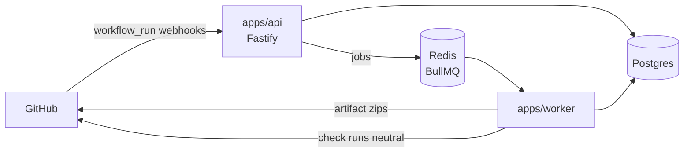
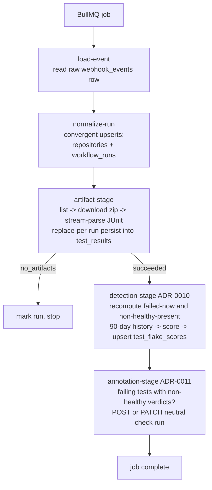
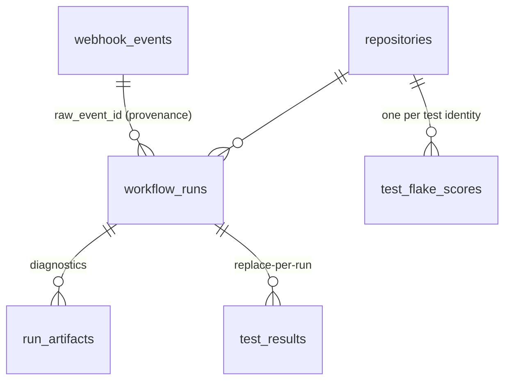

# System Overview (as of Milestone 3)

> Drawn from code that exists, not intentions. Update alongside the milestone that changes it. Decision history: [../adr/](../adr/).

## Context

DevFlow is a self-hostable CI reliability platform for GitHub Actions: it ingests workflow runs, parses JUnit artifacts, computes deterministic flakiness verdicts, and annotates PRs with advisory check runs.

- **`apps/api`** — receives webhooks: constant-time HMAC over raw bytes, verify-before-parse, delivery-GUID-idempotent append-only persist, then enqueue (ADR-0005).
- **`apps/worker`** — everything else: normalization, artifact fetch/parse, detection, annotation (ADR-0007/0009/0010/0011).
- **`packages/db`** — Drizzle schema + forward-only migrations; **`packages/queue`** — the api↔worker contract (dispatch, never storage).
- Dependency direction: apps → packages, never the reverse, never app → app.

## The processing pipeline (one job)

`process-workflow-run` jobs carry only `{webhookEventId, deliveryId}` — the raw event in Postgres is the source of truth; Redis loss loses scheduling, never data.

Failure taxonomy at every stage: `PermanentJobError` → absorbed (run marked `failed`, or annotation skipped with a warning — never retried); anything else → rethrown for BullMQ's exponential backoff (5 attempts, failed set = DLQ). The whole job is convergent under retry: upserts, replace-per-run, recompute-from-history, PATCH-by-stored-id.

## Data model (normalized side)

- `workflow_runs` is keyed `(github_run_id, run_attempt)` — attempts are separate rows on purpose: same-commit divergence across attempts is the strongest flakiness signal (ADR-0008).
- `test_results` has deliberately **no** unique identity constraint (parameterized tests repeat names); idempotency is replace-per-run.
- `test_flake_scores` is **derived data** — rebuildable from `test_results` at any time; evidence counts are stored so any verdict can be explained without recomputation (ADR-0010).
- Tenancy root until M4: the GitHub App installation (`repositories.installation_id`).

## Detection in one paragraph (ADR-0010)

Per test identity `(repository, suite, class, name)`: collect adjacent outcome flips — same-commit flips weigh 1.0 (the code didn't change; near-definitional flakiness), cross-commit flips on the default branch weigh 0.25 (the code may be at fault). Each flip decays with a 14-day half-life; `score = evidence/(evidence+2)`; flaky ≥ 0.5, suspected ≥ 0.25. A test that always fails accumulates **zero** evidence (no flips) — broken is not flaky, structurally. Verdicts reach developers only through the advisory `neutral` check run (ADR-0011), which cannot block a merge.
