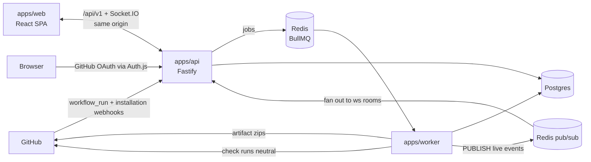
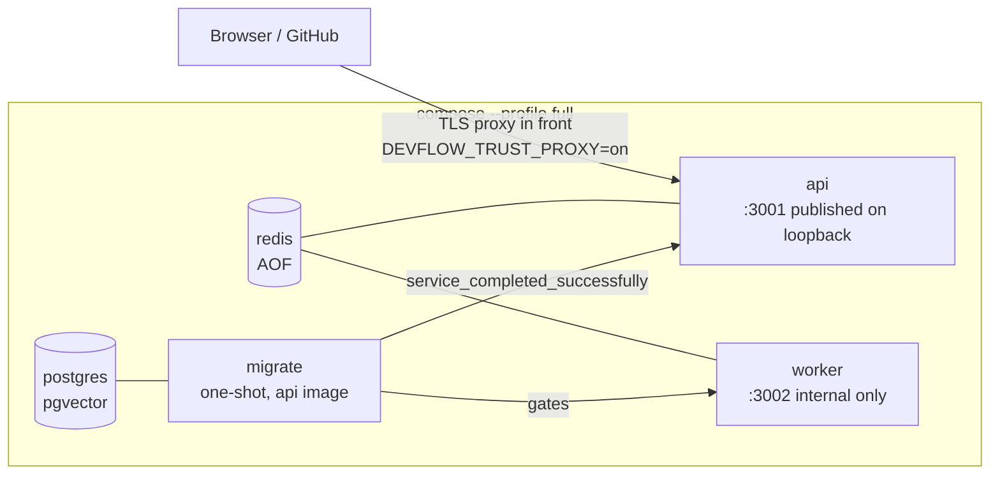
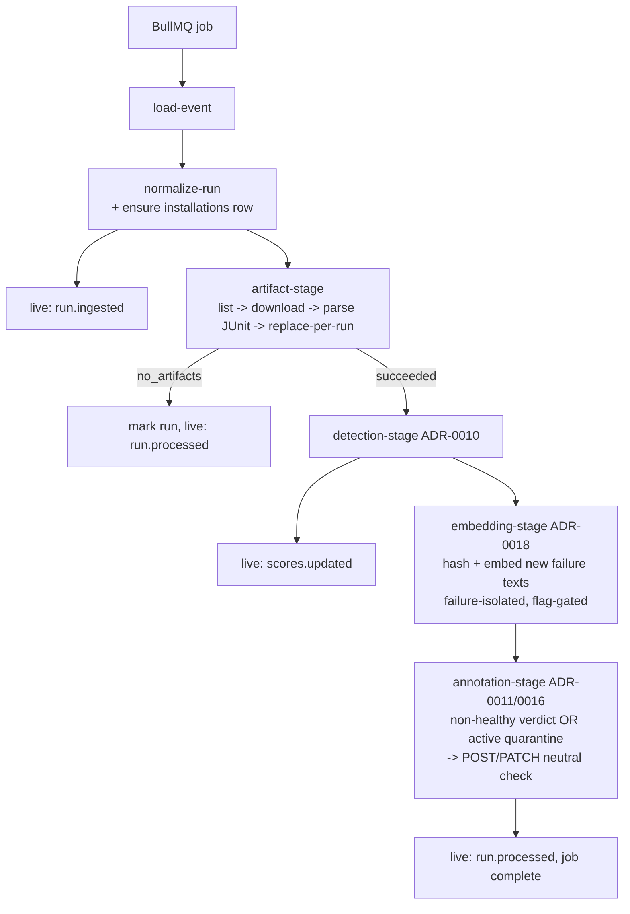
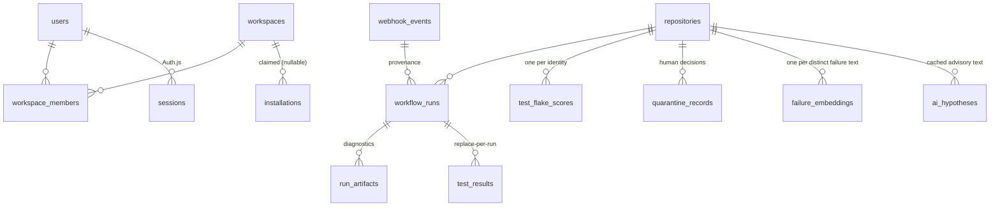

# System Overview (as of Milestone 6)

> Drawn from code that exists, not intentions. Update alongside the milestone that changes it. Decision history: [../adr/](../adr/).

## Context

DevFlow is a self-hostable CI reliability platform for GitHub Actions: it ingests workflow runs, parses JUnit artifacts, computes deterministic flakiness verdicts, annotates PRs with advisory check runs, surfaces everything in a workspace-scoped dashboard with a live feed and a human-approved quarantine workflow, and (since M5) offers an **amputable AI layer**: local-embedding semantic search and failure clustering, plus BYO-key LLM root-cause hypotheses (ADR-0017–0019). Since M6 the whole product runs containerized with one command ([self-hosting.md](../self-hosting.md), ADR-0020) and exposes health + Prometheus metrics on both processes (ADR-0021).

- **`apps/api`** — webhooks (HMAC, verify-before-parse, GUID-idempotent, ADR-0005) + user auth (`@auth/core` mount, database sessions, ADR-0013) + the public `/api/v1` (ADR-0014) + Socket.IO fan-out (ADR-0015) + optional static serving of the built SPA.
- **`apps/worker`** — normalization, artifact fetch/parse, detection, annotation, installation lifecycle, live-event publishing (ADR-0007/0009/0010/0011/0015).
- **`apps/web`** — Vite React SPA; consumes only `/api/v1` + the socket, typed by **`packages/contract`** (type-only DTOs/events — how web and api share a wire contract without importing each other).
- **`packages/ai`** — the amputable AI layer (ADR-0017): local MiniLM embedder, failure-text hashing, deterministic clustering, plain-fetch LLM provider. Its permitted call sites are enumerated in the ADR; deleting the package + seams leaves a fully functional product.
- **`packages/db`** — Drizzle schema + forward-only migrations (0000–0004); **`packages/queue`** — api↔worker contract (jobs + the live-events channel name).
- Dependency direction: apps → packages, never the reverse, never app → app.

## Deployment (ADR-0020)

One `compose.yaml`, two modes: the default starts only dev infrastructure (Postgres with pgvector, Redis with AOF) and the apps run natively; `docker compose --profile full up` runs the product.

- Multi-stage `node:22-slim` images; pruned `pnpm deploy --legacy` runtime layouts running as `USER node`.
- The api image carries the built dashboard (served same-origin behind `DEVFLOW_WEB_DIST`), the committed migrations, and the embedding model; the worker image carries the model too (`warm-model.js` bakes it at build — air-gapped deploys work with zero first-boot downloads).
- Migrations run once per rollout in the `migrate` service (drizzle's programmatic migrator over committed SQL); a failed migration halts the rollout with the apps unstarted.
- Healthchecks poll `/healthz` via `node -e fetch(...)` — real dependency checks (ADR-0021), so `docker compose ps` tells the truth and `depends_on` ordering flows from it.

## Observability (ADR-0021)

- `GET /healthz` on both processes runs real dependency checks (`SELECT 1` + Redis `PING`); the worker's is a plain `node:http` server on its own port.
- `GET /metrics` (Prometheus text, `prom-client`) on both: request-duration and webhook-outcome metrics on the api; job results/durations, queue-state gauges, embeddings, check-run writes and live events on the worker. The alertable number is `devflow_queue_jobs{state="failed"}` — the DLQ.
- Exposure posture: `/metrics` is unauthenticated; the worker's port never leaves the compose network and the api's sits behind the reverse proxy (allow only your monitoring network). Metric names are API surface — renames are breaking changes.

## Tenancy (ADR-0012)

`workspaces` ← `workspace_members` (users, owner|member) and `workspaces` ← `installations` (nullable `workspace_id`: **unclaimed** until a workspace connects it via the signed-state GitHub Setup-URL redirect). Everything ingested resolves its tenant at read time: `repositories.installation_id → installations.github_installation_id → installations.workspace_id`. The ingest write path is tenant-unaware by design — data accrues for unclaimed installations and becomes visible on claim (pre-M4 rows were backfilled as unclaimed). Isolation is application-layer: session + membership preHandlers (404, no existence oracle), workspace-scoped queries, and a cross-tenant denial integration test per endpoint; RLS is deferred with a recorded trigger.

## The processing pipeline (one job)

`process-workflow-run` jobs carry only `{webhookEventId, deliveryId}` — the raw event in Postgres is the source of truth; Redis loss loses scheduling, never data. `process-installation-event` jobs (same shape) keep `installations` in sync.

Failure taxonomy unchanged (permanent → absorbed; transient → backoff retry; failed set = DLQ); live publishing is fire-and-forget and can never fail a job.

## Data model (normalized side)

- `test_flake_scores` is **derived, rebuildable** cache; `quarantine_records` is **durable human truth** — which is why quarantine copies the test identity instead of referencing the score row (ADR-0016).
- Reads apply **decay-at-read** (ADR-0014): a stored score is worth `s' = e'/(e'+K)` where `e' = K·s/(1−s) · 2^(−Δdays/H)` — evaluated in SQL so ranking, filters and pagination agree; a stale flaky verdict quietly degrades to healthy.

## The AI layer in one paragraph (ADR-0017/0018/0019)

Search and clustering are **key-free and local**: failed results get a content hash; each distinct failure text per repository embeds once (MiniLM, 384-dim, CPU, in-process) into pgvector; search is exact cosine over the workspace's vectors, clusters are greedy single-link geometry computed per request. Hypotheses are the only LLM surface: a human clicks, the evidence is digested, Claude (BYO key) answers once, and the result is cached with provenance and rendered under an advisory disclosure. AI output reaches exactly two sinks — embeddings and hypothesis text — and never touches scores, quarantine, or check runs. Deleting `packages/ai` and its enumerated seams leaves the product whole.

## Detection in one paragraph (ADR-0010)

Per test identity `(repository, suite, class, name)`: collect adjacent outcome flips — same-commit flips weigh 1.0 (the code didn't change; near-definitional flakiness), cross-commit flips on the default branch weigh 0.25. Each flip decays with a 14-day half-life; `score = evidence/(evidence+2)`; flaky ≥ 0.5, suspected ≥ 0.25. A test that always fails accumulates **zero** evidence — broken is not flaky, structurally. Verdicts reach developers through the advisory `neutral` check run (cannot block a merge), the dashboard ranking, and — after a human approves a proposal — the quarantine label ("known flaky, safe to ignore"). The system proposes; only humans quarantine (D14).
